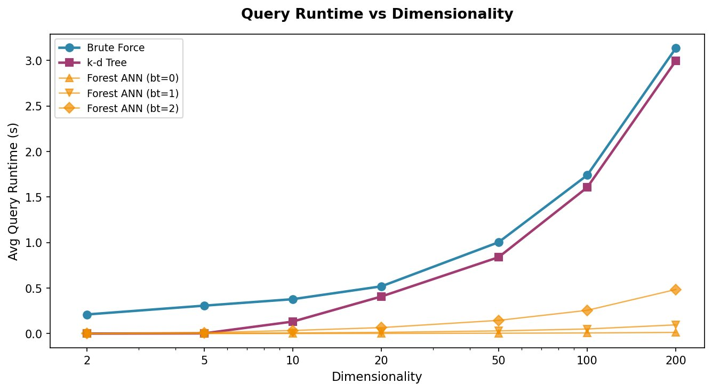
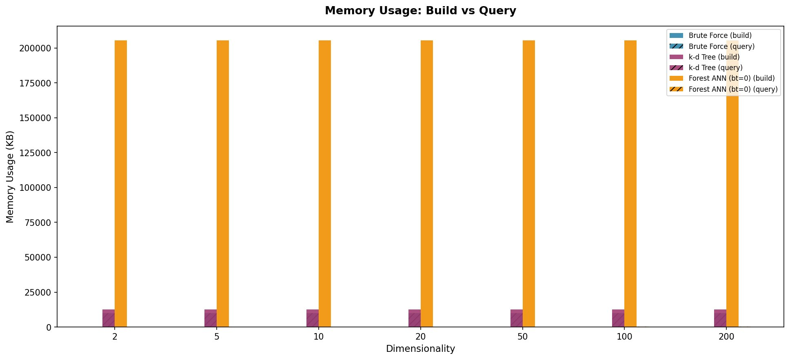
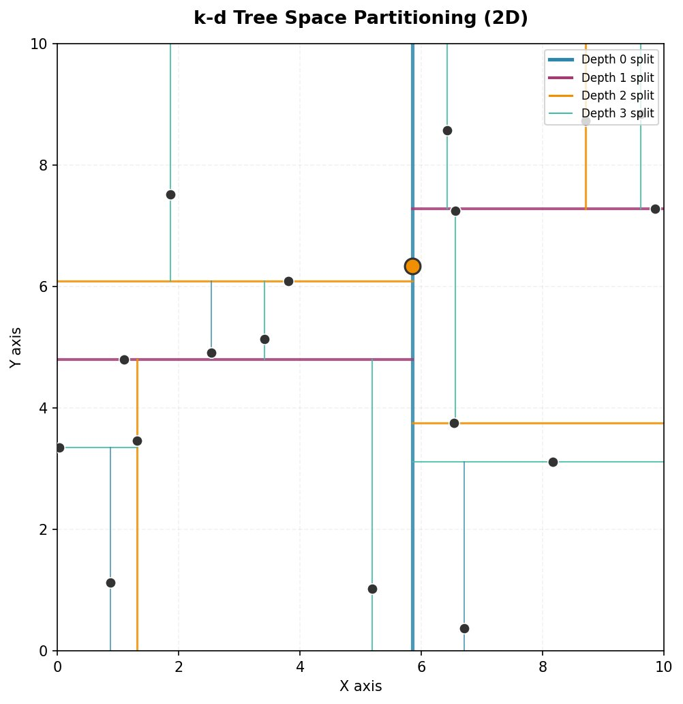
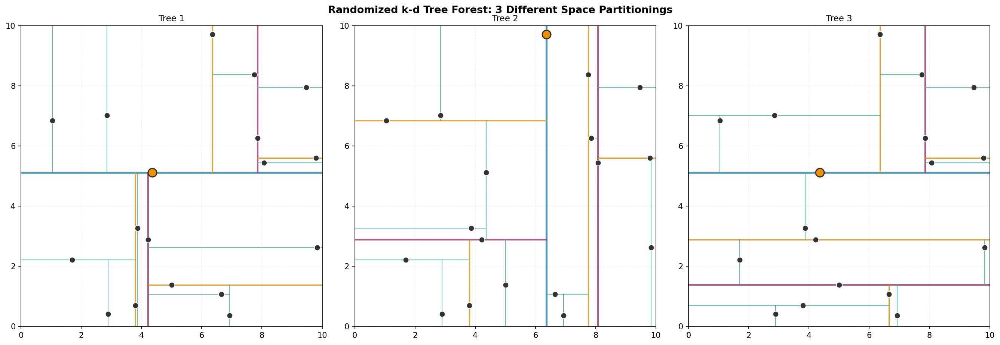

# nearest-neighbor-search

**Algorithmic Approaches to Efficient Nearest Neighbor Search in High-Dimensional Data**

Comparative implementation and benchmark of five k-nearest neighbor search algorithms across synthetic clustered datasets spanning d=2 to d=200 dimensions.

---

## Algorithms

| Algorithm | Type | Complexity (query) |
|---|---|---|
| Brute Force | Exact | O(nd + n log n) |
| k-d Tree | Exact | O(log n) best, O(n) worst |
| Forest ANN bt=0 | Approximate | O(m · log n) |
| Forest ANN bt=1 | Approximate | O(m · (log n + 1)) |
| Forest ANN bt=2 | Approximate | O(m · (log n + 2)) |

The Forest ANN is a randomized k-d tree forest (20 trees, 2 candidate axes per split) using a depth-first search query module with a configurable backtracking budget. Inspired by Lu & Gweon (2019) and conceptually similar to ANNOY.

---

## Key Results

Evaluated on 100,000-point synthetic clustered datasets, 50 queries per dimensionality, k=10.

### Query Runtime (seconds)

| Dim | Brute Force | k-d Tree | ANN bt=0 | ANN bt=1 | ANN bt=2 |
|-----|-------------|----------|----------|----------|----------|
| 2   | 0.2397 | 0.0001 | 0.0005 | 0.0010 | 0.0013 |
| 10  | 0.3854 | 0.1023 | 0.0010 | 0.0073 | 0.0338 |
| 20  | 0.5052 | 0.3915 | 0.0016 | 0.0124 | 0.0616 |
| 50  | 0.9397 | 0.7671 | 0.0030 | 0.0233 | 0.1211 |
| 200 | 3.0325 | 3.1177 | 0.0144 | 0.0978 | 0.4945 |

The k-d tree converges toward brute force around d=20 and marginally exceeds it at d=200 — the curse of dimensionality in action. All three ANN variants remain consistently faster across every tested dimensionality.

### Accuracy (fraction of true k-NN returned)

| Dim | ANN bt=0 | ANN bt=1 | ANN bt=2 |
|-----|----------|----------|----------|
| 2   | 0.372 | 0.826 | 0.996 |
| 5   | 0.676 | 0.974 | 0.998 |
| 20  | 0.124 | 0.616 | 0.942 |
| 100 | 0.020 | 0.184 | 0.558 |
| 200 | 0.012 | 0.106 | 0.392 |

bt=2 achieves near-perfect accuracy at low dimensionalities while remaining ~6x faster than brute force at d=200. The backtracking budget is the key hyperparameter controlling the accuracy-speed tradeoff.

### Figures

| | |
|---|---|
|  |  |
|  |  |

---

## Project Structure

```
knn-comparison/
├── knn_benchmark.py          ← all algorithm implementations, testing, and visualization
├── docs/
│   └── knn_comparison_paper.pdf   ← full paper (ACM format)
├── figures/                  ← output plots (committed)
│   ├── fig1_runtime.png
│   ├── fig2_memory.png
│   ├── fig3_kdtree_partition.png
│   └── fig4_forest_partitions.png
├── results_log.txt           ← benchmark output across 3 runs
├── DEVELOPMENT_NOTES.md      ← implementation notes and future work
└── src/                      ← modular refactor (in progress)
    ├── utils.py
    ├── brute_force.py
    ├── kdtree.py
    └── ann/
        └── early_termination.py
```

---

## Usage

```bash
pip install numpy matplotlib
python knn_benchmark.py
```

Runs all five algorithms across d=2,5,10,20,50,100,200, prints results to stdout and appends to `results_log.txt`, and saves figures to the working directory.

Key parameters (set at top of `run_tests()`):

```python
dimensions = [2, 5, 10, 20, 50, 100, 200]
n_points   = 100_000   # dataset size
n_queries  = 50        # queries per dimensionality
k          = 10        # nearest neighbors
# Forest hyperparameters:
n_trees    = 20
candidate_axes = 2
backtracks = [0, 1, 2]
```

---

## Paper

Full write-up including algorithm analysis, experimental methodology, and discussion:
[`docs/knn_comparison_paper.pdf`](docs/knn_comparison_paper.pdf)

---

## References

1. J. L. Bentley. 1975. Multidimensional binary search trees. *CACM* 18, 9.
2. N. Sample et al. 2001. Optimizing search strategies in k-d trees. *IEEE TPAMI* 23, 6.
3. K. Hajebi et al. 2011. Fast ANN search with k-NN graph. *CVPR*.
4. J. Lu and H. Gweon. 2019. Random k conditional nearest neighbor. *Pattern Recognition* 96.
5. V. Kazakovtsev et al. 2025. Fast adaptive ANN with cluster-shaped indices. *Big Data and Cognitive Computing* 9, 10.
6. Y. A. Malkov and D. A. Yashunin. 2018. HNSW. *IEEE TPAMI* 42, 4.
7. E. Bernhardsson. 2015. Annoy. https://github.com/spotify/annoy
